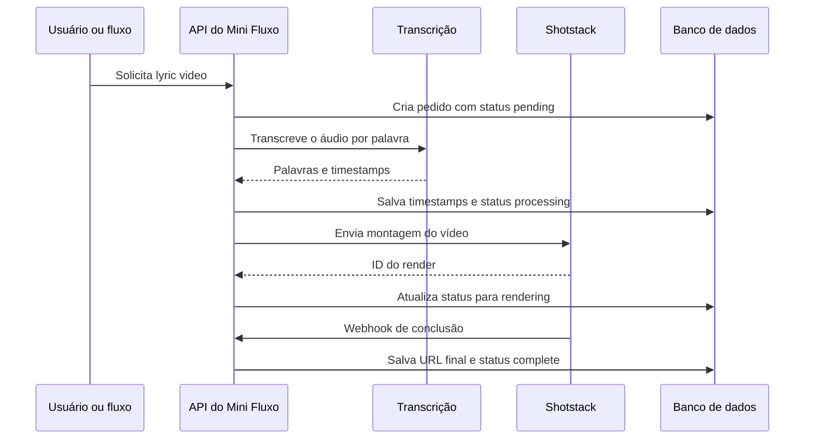

# Gerador de Lyric Video

## Objetivo

O gerador cria um vídeo vertical de 60 segundos com a música do cliente, um tema visual e letras grandes sincronizadas com o áudio. Ele pode ser usado de duas formas:

- Pelo painel de vídeos, com MP3 enviado manualmente.
- Pelo card **Gerar lyric video** dentro do fluxo, depois do card **Gerar música** da Kie.ai.

O mesmo motor é usado nos dois caminhos. Portanto, o padrão visual, a sincronização e os mecanismos de proteção contra falhas são iguais.

## Resultado entregue

O vídeo final tem as seguintes características:

- Formato vertical de `1080 × 1920`, em MP4 e 30 fps.
- Duração fixa de 60 segundos.
- Música original como trilha sonora, com fade de entrada e saída.
- Fundo com template do tema escolhido.
- Letras em Inter Black, caixa alta, centralizadas na região livre do card visual.
- Tamanho dinâmico: começa em 96 px e diminui somente quando a frase precisa caber em até três linhas.
- Borda preta discreta de 2 px e sombra suave para preservar contraste sobre fundos claros ou texturizados.
- Frases curtas e legíveis, em vez de uma linha interminável ou palavras isoladas espalhadas.

## Como configurar no fluxo

No construtor, use a sequência abaixo:

```text
Pagamento confirmado
        ↓
Gerar música (Kie.ai)
        ↓
Gerar lyric video
        ↓
Entrega gerada
```

O card deve ficar depois de **Gerar música**. Quando a Kie devolve as faixas, o fluxo recebe as URLs e o gerador usa automaticamente a primeira delas.

No card **Gerar lyric video**, há dois campos:

| Campo | Uso |
| --- | --- |
| Tema | Define o template visual do vídeo. |
| Frase de abertura | Texto opcional mostrado antes da primeira legenda. Máximo de 90 caracteres. |

Temas disponíveis:

| Valor técnico | Nome no card | Fundo |
| --- | --- | --- |
| `romantic_rose` | Romântico Rosé | Visual romântico vermelho e rosé. |
| `night_love` | Noite de Amor | Visual escuro e elegante. |
| `soft_gold` | Dourado Suave | Visual quente e sofisticado. |

O card dispara o render em segundo plano. O fluxo não precisa esperar o vídeo terminar para continuar com os próximos cards, como a entrega dos áudios no WhatsApp.

## Dados que o card utiliza

Para cada pedido, o motor lê os dados abaixo:

| Dado | Origem | Finalidade |
| --- | --- | --- |
| Primeira música | Primeiro URL retornado pela Kie.ai | Trilha e transcrição. |
| Letra do pedido | `lead.order_context.lyricText` | Contexto de português e registro do conteúdo pedido. |
| ID do pedido | `sourceOrderId` ou `external_order_id` | Vincula o vídeo ao pedido original. |
| Tema e abertura | Configuração do card | Define o visual e a introdução. |
| Chave GPT | Credencial do fluxo, conta ou ambiente | Transcreve e obtém o tempo de cada palavra. |

Se não houver música ou letra, o card interrompe essa etapa com uma mensagem clara. Isso evita gerar um vídeo para o pedido errado.

## Sincronização da letra

### Fonte dos tempos

O áudio é enviado ao serviço de transcrição com idioma português e retorno por palavra. A letra original é enviada somente como contexto de vocabulário; os tempos vêm do áudio.

Essa decisão resolve um problema comum: a música pode ter pequenas mudanças na letra em relação ao texto salvo no pedido. A legenda precisa acompanhar o que foi cantado, e não exibir uma frase diferente no tempo errado.

### Formação das frases

As palavras reconhecidas são agrupadas em blocos quando ocorre uma destas condições:

- O grupo chega a seis palavras.
- O grupo dura mais de 3,2 segundos.
- Há uma pausa de mais de 0,9 segundo.
- Há pontuação de encerramento depois de pelo menos três palavras.

Cada bloco recebe o início da primeira palavra e o fim da última. O texto de um bloco é dividido visualmente em uma a três linhas, de acordo com a largura disponível.

### Proteções contra palavras ausentes

O gerador não aceita unidades internas incompletas. Quando timestamps recebidos contêm uma frase completa, mas as unidades internas não cobrem exatamente todas as palavras, ele reconstrói as unidades a partir da frase completa.

Também não faz uma linha desaparecer quando a próxima começa. Todas as linhas de uma frase ficam visíveis até o final daquele bloco. Isso preserva o contexto de leitura e evita o efeito de a letra “sumir”.

O corte final inclui palavras que terminam no segundo 60; palavras que começam depois disso não entram no vídeo.

## Regras de posicionamento e legibilidade

As legendas ficam no centro horizontal do vídeo e centralizadas verticalmente em torno de `y = 800 px`. Essa região foi escolhida para não competir com o título no topo nem com o visualizador e os controles na parte inferior.

O contêiner tem largura de 760 px. O motor estima a largura dos caracteres antes de renderizar, respeita uma margem interna de 48 px e reduz o tamanho somente até o texto caber. Se ainda não couber em três linhas, a requisição falha com um erro explícito em vez de cortar a legenda.

Cada linha usa:

```js
font: {
  family: 'Inter',
  weight: 900,
  color: '#FFFFFF'
},
stroke: {
  width: 2,
  color: '#120A0D',
  opacity: 0.9
},
shadow: {
  offsetY: 3,
  blur: 8,
  color: '#000000',
  opacity: 0.7
}
```

O contorno é propositalmente fino. A função dele é separar a letra do fundo, sem parecer uma caixa atrás do texto.

## Ciclo de execução



## Estados do pedido

Os registros ficam na tabela `lyric_video_orders`.

| Estado | Significado |
| --- | --- |
| `pending` | Pedido criado, aguardando preparação. |
| `processing` | Áudio transcrito e timestamps sendo salvos. |
| `rendering` | Montagem aceita pela Shotstack e em renderização. |
| `complete` | Vídeo final disponível em `output_url`. |
| `failed` | Alguma etapa falhou; a descrição fica em `error`. |

O painel lista esses pedidos e mostra a URL do vídeo quando o status é `complete`.

## Proteção contra duplicidade no fluxo

Callbacks da Kie podem ser repetidos. Antes de iniciar um render, o card verifica:

```text
lead.order_context.flow_data.lyric_videos.<id-do-card>.order_id
```

Se já existir um `order_id` para aquele card e pedido, o fluxo reutiliza esse resultado e não abre outra renderização. Depois de iniciar com sucesso, o card grava o ID do vídeo, status, URL da música e horário de criação nesse mesmo local.

## API manual

O painel utiliza `POST /api/lyric-videos`.

Exemplo de corpo:

```json
{
  "audio_url": "storage://video-inputs/<usuario>/audio/<arquivo>.mp3",
  "lyrics": "Texto completo da música...",
  "theme": "romantic_rose",
  "intro_text": "Uma música feita para você"
}
```

Também é possível fornecer `lyrics_timestamps` para pular a transcrição. Cada item deve ter `start`, `end`, `text` e, opcionalmente, `units`. Os tempos precisam estar entre 0 e 60 segundos.

No painel manual, o MP3 precisa pertencer ao bucket do usuário autenticado. No fluxo, o motor aceita a URL remota da faixa retornada pela Kie.ai.

## Variáveis de ambiente necessárias

| Variável | Necessária para |
| --- | --- |
| `SHOTSTACK_API_KEY` | Enviar renders para a Shotstack. |
| `SHOTSTACK_WEBHOOK_SECRET` | Validar o callback de conclusão. |
| `SHOTSTACK_ENVIRONMENT` | Opcional; define o ambiente da Shotstack. Padrão: `v1`. |
| `APP_URL` | Base da URL de callback. Padrão: domínio de produção do Mini Fluxo. |
| `OPENAI_API_KEY` | Fallback para transcrição quando não há chave GPT da conta ou fluxo. |

No fluxo, a chave GPT pode vir das credenciais protegidas da conta ou do próprio fluxo e tem prioridade sobre a chave global.

## Falhas e diagnóstico

| Sintoma | Causa provável | Ação recomendada |
| --- | --- | --- |
| Card informa que não há música | O card está antes da Kie ou o callback ainda não devolveu a faixa. | Conecte depois de **Gerar música** e aguarde a Kie terminar. |
| Card informa que não há letra | O pedido não recebeu `lyricText`. | Verifique o payload de criação/pagamento do pedido. |
| Status `failed` com erro de transcrição | Arquivo inacessível ou chave GPT ausente/inválida. | Verifique a URL do áudio e a credencial GPT. |
| Letra diferente do pedido | A música cantada não corresponde à letra registrada. | Gere a música com a letra correta; o vídeo prioriza o que está no áudio para manter sincronismo. |
| Render rejeitado | Chave, template ou campos inválidos na Shotstack. | Consulte o campo `error` e os logs da rota. |
| Vídeo ainda não aparece | A Shotstack ainda está processando. | Aguarde o webhook alterar o estado para `complete`. |

## Arquivos principais

| Arquivo | Responsabilidade |
| --- | --- |
| `lib/lyric-video/build-shotstack-edit.js` | Monta fontes, layout, borda, sombra, trilha e tracks do render. |
| `lib/lyric-video/captions.js` | Normaliza timestamps, protege contra palavras faltantes e agrupa frases. |
| `lib/lyric-video/sync-lyrics.js` | Transcreve o áudio por palavra e cria os blocos sincronizados. |
| `lib/lyric-video/submit.js` | Cria o pedido, chama transcrição, envia a Shotstack e atualiza status. |
| `app/api/lyric-videos/route.js` | Rota do painel manual. |
| `app/api/flow-engine.js` | Executa o card `lyricVideo` dentro do fluxo. |
| `app/api/webhooks/shotstack-lyric-video/route.js` | Recebe a conclusão do render. |
| `app/dashboard/flow-canvas.js` | Define e configura o card no construtor visual. |

## Testes atuais

O arquivo `lib/lyric-video/captions.test.mjs` verifica que:

- Units incompletas não eliminam palavras da frase.
- Frases longas são divididas sem perder conteúdo.
- As linhas respeitam a área central segura.
- Todas as linhas têm duração positiva e permanecem até o fim do bloco.
- A borda preta esperada faz parte de cada legenda.
- Palavras que atravessam o segundo 60 permanecem no último bloco.

Para executar:

```bash
node --test lib/lyric-video/captions.test.mjs
```

## Regra de qualidade antes de entregar ao cliente

Antes de enviar um lyric video, confira pelo menos três momentos do MP4: início das legendas, uma frase longa no meio e o trecho final. Valide que o áudio e o texto cantado correspondem. Essa última checagem é indispensável quando a música foi gerada a partir de uma letra revisada depois do pedido.
